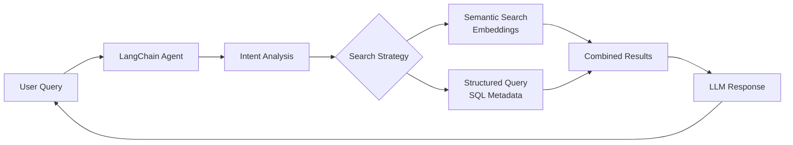

# Interactive CV Project - CLAUDE.md

## Recent Major Refactoring (2025-01-03)

### Database System Overhaul
We completely redesigned the database structure for cleaner, more efficient data management:

1. **Renamed `metadata_system/` → `DB/`** for simplicity
2. **Normalized Database Schema**:
   - Single unified `relationships` table (no more redundancy!)
   - Enhanced entity tables with proper attributes
   - Pre-computed `graph_nodes` and `graph_edges` tables for performance
   - Direct entity/relationship creation during extraction
3. **Cleaner Extraction Workflow**: 
   - No more intermediate JSON → database scripts
   - Extractors write directly to normalized tables
   - Relationships created on-the-fly during extraction

### Agents System Architecture
1. **Two-Step Academic Workflow**:
   - **Academic Analyzer**: Analyzes raw papers following `How_to_analyze.md` methodology → produces structured analyses
   - **Academic Extractor**: Extracts entities/relationships from analyses (not raw papers)
2. **Chronicle Extractor**: Processes daily/weekly/monthly notes
3. **Simplified Config Structure**: Single `extraction_schema.json` for academic, `extraction_config_simple.yaml` for chronicle

**Key Insight**: The system now combines AI agents with a clean relational database, eliminating all redundancy while supporting both RAG queries and knowledge graph visualization.

## Project Overview

This project creates an **Interactive CV System** that transforms academic research papers and personal chronicle notes into a dynamic, queryable professional profile. The system uses AI to extract metadata, build a knowledge graph, and enable intelligent conversations about your research expertise and work history.

**Core Purpose**: Build a RAG-powered interactive CV that can answer questions about your research, skills, and experience by analyzing your academic papers and daily notes.

## System Architecture

### Data Sources
1. **Academic Papers** (`/academic/`)
   - Paper transcripts (PDFs → Markdown)
   - Detailed analyses of each paper
   - Mathematical concepts, methods, applications

2. **Chronicle Notes** (`/chronicle/`)
   - Daily notes with work progress
   - Weekly/monthly summaries
   - Project updates and insights

### Database System Design

We use a **normalized SQLite database** with clean entity-relationship structure:

**Core Tables:**
- **Document Tables**: 
  - `chronicle_documents`: Daily/weekly/monthly notes from Obsidian
  - `academic_documents`: Research papers and analyses
  - `documents`: Unified view for backward compatibility
- **Entity Tables** (with attributes):
  - `topics`: Mathematical concepts, research areas (name, category, description)
  - `people`: Authors, collaborators (name, role, affiliation)
  - `projects`: Research projects (name, description, dates)
  - `institutions`: Universities, research centers (name, type, location)
  - `methods`: Algorithms, techniques (name, category, description)
  - `applications`: Real-world uses (name, domain, description)
- **Relationship & Graph**:
  - `relationships`: Single unified table for ALL connections (no redundancy!)
  - `graph_nodes` & `graph_edges`: Pre-computed for visualization
  - `document_chunks`: Semantic segments for RAG
  - `chunk_entities`: Maps entities to chunks
  - `embeddings`: Vector storage for all entities

**Design Principles:**
- Single source of truth (no duplicate data)
- Direct extraction to database (no intermediate JSON processing)
- Graph-ready structure with pre-computed metrics
- Flexible JSON metadata fields for extensibility
- Unified ID format: `{type}_{id}` (e.g., 'academic_1', 'chronicle_2')

### Chunking and Extraction Strategy

**Core Principle**: Extraction needs context, retrieval needs focus.

We use a multi-stage pipeline that preserves full context during extraction while enabling efficient retrieval:

1. **Full Document Analysis**: LLM analyzes complete paper (all 3 phases)
2. **Entity Extraction**: Extract from FULL analysis (sees complete context)
3. **Database Population**: Store entities and relationships atomically
4. **Smart Chunking**: Split AFTER extraction into 1000-1500 token chunks
5. **Entity Mapping**: Map which entities appear in each chunk
6. **Embeddings**: Generate for documents, chunks, and entities

**Why This Order Matters**:
- Extraction catches cross-document references and relationships
- Chunking preserves semantic boundaries
- Each chunk knows its entities (no re-extraction needed)
- Queries can use entities, embeddings, or both

### Enhanced Templates

We've created metadata-rich templates for chronicle notes:

```yaml
# Daily Note Template
---
date: {{date}}
topics: []  # [optimal-transport, machine-learning]
people: []  # Collaborators mentioned
projects: []  # Active projects
papers: []  # Papers referenced
tools: []  # Technologies used
insights: []  # Key breakthroughs
---
```

### LangChain Agent with OpenRouter

We use LangChain with OpenRouter (Gemini 2.5 Flash) for intelligent metadata extraction. After testing multiple prompt strategies, we refined the approach to focus on research connections and technical achievements:

```python
from langchain_openai import ChatOpenAI
from dotenv import load_dotenv

load_dotenv()

llm = ChatOpenAI(
    base_url="https://openrouter.ai/api/v1",
    api_key=os.getenv("OPENROUTER_API_KEY"),
    model="google/gemini-2.5-flash",
    default_headers={
        "HTTP-Referer": "http://localhost:3000",
        "X-Title": "Interactive CV Metadata Extractor",
    }
)
```

**Prompt Testing Results**: We tested three prompt approaches and selected the Research-Focused variant that captures the most comprehensive project details and technical insights.

## Implementation Progress

### ✅ Completed
1. **Project Structure**: Set up directories and initial files
2. **Template Enhancement**: Created metadata-rich daily/weekly/monthly templates
3. **Academic Analysis**: Completed comprehensive analysis of all research papers
4. **Metadata Schema Design**: Defined extraction patterns for both academic and chronicle data
5. **LangChain Integration**: Built and tested metadata extractor with OpenRouter and Gemini 2.5 Flash
6. **Prompt Optimization**: Tested multiple prompt strategies and improved people extraction
7. **SQLite Database**: Created database with proper schema, indexes, and relationships
8. **Metadata Extraction System**: Built base extractor with change detection and transaction support
9. **Chronicle Integration**: Integrated LLM extractor with database storage
10. **Sync-Based System**: Replaced file watcher with unified sync script that handles files + metadata
11. **Academic Import**: Successfully imported 12 papers with comprehensive metadata
12. **Query Tools**: Created comprehensive database query scripts
13. **Embeddings System**: Added OpenAI embeddings for all documents and chunks
14. **Remote Sync**: Automatic sync of files and database to portfolio-ts54
15. **Knowledge Graph**: Interactive visualization with 209 nodes and 264 relationships
16. **Database Cleanup**: Fixed person name extraction issues
17. **Visualization Tools**: Datasette for DB exploration, vis.js for graph visualization
18. **Graph-Enhanced Queries**: Combined SQL + graph traversal for intelligent queries
19. **Database Restructuring**: Split documents table into chronicle_documents and academic_documents
20. **Knowledge Graph Refactoring**: Made completely database-agnostic and consolidated into single file
21. **Institution Support**: Added institutions as first-class entities with proper relationships
22. **Database Schema Documentation**: Created comprehensive DATABASE_SCHEMA.md file
23. **Academic Pipeline**: Complete process_paper_pipeline.py for end-to-end paper processing

### 📋 TODO
1. **Query API**: REST/GraphQL interface for searching and retrieving information
2. **RAG Pipeline**: Connect embeddings to LLM for intelligent responses
3. **Web Interface**: Frontend for interactive CV queries
4. **Production Deployment**: Set up on remote server

## Key Design Decisions

### Why SQLite?
- Single source of truth
- Efficient querying with SQL
- Handles relationships well (topics, people, projects)
- Easy backup and migration
- Supports JSON fields for flexible metadata

### Why Separate Academic/Chronicle Processing?
- **Academic**: Rarely changes, one-time bulk extraction
- **Chronicle**: Daily updates, needs file watcher
- Different metadata schemas and extraction strategies

### Why LangChain + OpenRouter?
- Unified API for multiple LLMs
- Gemini 2.5 Flash: Fast and cost-effective for metadata extraction
- Structured output with Pydantic schemas
- Easy to switch models if needed

## Metadata Extraction Strategy

### Academic Papers
Extract comprehensive metadata including:
- Mathematical concepts and methods
- Key innovations and contributions
- Applications and practical impact
- Collaborators and research connections
- Limitations and future directions

### Chronicle Notes
Use LLM to extract nuanced metadata:
- Work focus and project progress
- Technical breakthroughs with context
- Problems solved and solutions
- Learning moments and insights
- Connections to academic research

## RAG Architecture



## Usage Examples

### Query Examples
- "What papers has Vaios written about optimal transport?"
- "Show me his experience with neural networks"
- "When did he work on reinforcement learning projects?"
- "What are his key mathematical contributions?"

### Expected Responses
The system combines:
- Formal expertise from academic papers
- Practical experience from daily notes
- Project progress and collaborations
- Personal insights and learning journey

## File Structure
```
/interactive_cv/
├── academic/               # Research papers and analyses
├── chronicle/              # Daily/weekly notes (synced from Obsidian)
├── DB/                     # Database and extraction system
│   ├── extractors/         # Base and chronicle extractors
│   ├── embeddings.py       # Vector embedding generation
│   ├── metadata.db         # SQLite database (not in git)
│   └── query_comprehensive.py  # Database exploration tool
├── KG/                     # Knowledge Graph system
│   ├── knowledge_graph.py  # Graph builder from database
│   └── graph_enhanced_query.py  # Graph-aware query system
├── .sync/                  # Sync scripts
│   ├── sync-chronicle      # Shell wrapper
│   └── sync_chronicle_with_metadata.py  # Main sync logic
├── metadata_extractor.py   # LLM metadata extraction
├── requirements.txt        # Python dependencies
├── note.md                 # Core ideas and decisions
├── CLAUDE.md              # This file
├── cleanup_people.py       # Database cleanup utilities
├── view_database.sh        # Launch Datasette viewer
└── VISUALIZATION.md        # Visualization tools guide
```

## Current Status

### Database Status (Updated 2025-01-03)
- **Database**: Fully populated with all 12 academic papers
- **Academic Papers**: 12 papers successfully processed
- **Chronicle Notes**: 0 (sync system ready but not populated)
- **Entities Extracted**:
  - 192 topics (mathematical concepts, research areas)
  - 18 people (authors and researchers)
  - 57 methods (analytical and computational techniques)
  - 0 institutions (extraction needs enhancement)
- **Document Processing**:
  - 186 semantic chunks created
  - 447 embeddings generated
  - 315 relationships established
- **Pipeline Status**: ✅ Complete and operational

### Processing Results
- All 12 papers analyzed and stored
- Comprehensive metadata extracted using LLMs
- Semantic search capabilities enabled
- Knowledge graph data structure ready (graph_nodes/edges tables need population)

### Key Files
- `DB/metadata.db`: SQLite database with all metadata (✅ created and populated)
- `DB/DATABASE_SCHEMA.md`: Complete database schema documentation
- `DB/process_paper_pipeline.py`: End-to-end academic paper processing
- `agents/academic_analyzer.py`: Analyzes papers following How_to_analyze.md
- `agents/academic_extractor.py`: Extracts entities from analyses
- `.sync/sync_chronicle_with_metadata.py`: Main sync script with metadata extraction
- `.sync/sync-chronicle`: Shell wrapper for easy execution
- `DB/query_comprehensive.py`: Query tool to explore database
- `DB/embeddings.py`: Vector embedding generation
- `KG/knowledge_graph.py`: Database-agnostic graph generator
- `KG/graph_enhanced_query.py`: Graph-aware query system
- `KG/knowledge_graph.json`: Generated graph data
- `web_ui/index.html`: Interactive visualization (vis.js)
- `DB/extractors/base.py`: Base extractor for normalized schema

## Usage

### Academic Paper Processing

To process all academic papers through the pipeline:

```bash
# Process a single paper (for testing)
cd /home/artnoage/Projects/interactive_cv
python DB/process_paper_pipeline.py

# Process all papers (create a batch script)
python scripts/process_all_papers.py
```

The pipeline performs these steps for each paper:
1. **Analyze**: Generate comprehensive analysis using academic_analyzer
2. **Extract**: Extract entities and relationships using academic_extractor
3. **Store**: Save to normalized database with proper relationships
4. **Chunk**: Create semantic chunks for RAG
5. **Embed**: Generate embeddings for semantic search

### Chronicle Sync Commands
After setting up, use these commands from anywhere:

```bash
# Regular sync with metadata extraction
chronicle

# Dry run - see what would change
chronicle-dry

# Force re-extraction of all metadata
chronicle-force

# Check sync configuration
chronicle-status
```

### What the sync does:
1. Syncs from Obsidian Chronicles folder to local
2. Detects new/changed files using content hashes
3. Extracts metadata using LLM (topics, people, projects)
4. Generates embeddings for semantic search
5. Syncs both files and database to remote server

## Visualization & Analysis

### Database Viewer (Datasette)
```bash
./view_database.sh  # Launches Datasette on http://localhost:8001
```

Features:
- Browse all tables interactively
- Run SQL queries with autocomplete
- Export data in JSON/CSV formats
- Automatic API generation for queries
- Faceted search and filtering

### Knowledge Graph
```bash
python3 KG/knowledge_graph.py  # Generate/update graph
# Creates KG/knowledge_graph.json (required for queries)
```

Graph Statistics:
- 257 nodes (documents, topics, people, projects, semantic concepts, institutions)
- 326 edges showing relationships
- Interactive visualization with color-coded node types:
  - 🔴 Documents (red) - now split into academic_document and chronicle_document
  - 🔵 Topics (blue)
  - 🟢 People (green)
  - 🟠 Projects (orange)
  - 🟣 Semantic concepts (purple)
  - 🏛️ Institutions (teal)
- PageRank identifies most connected/important nodes
- Configurable via schema-driven extraction approach

### Alternative Desktop Tools
- **DB Browser for SQLite**: `sudo apt install sqlitebrowser`
- **DBeaver**: Professional database tool from https://dbeaver.io/

## Interactive Agent

An intelligent conversational agent that answers questions about research and professional journey using LangChain.

### Setup
```bash
# Ensure API keys are in .env:
# OPENROUTER_API_KEY=your_key_here
# OPENAI_API_KEY=your_key_here

# Run the agent
python interactive_agent.py
```

### Features
- Multi-tool architecture with specialized query tools
- Memory management for conversation history
- Semantic search using embeddings
- Knowledge graph integration for deeper insights
- Real-time streaming responses

### Available Tools
1. **search_academic_papers**: Find papers by topic or keywords
2. **search_chronicle_notes**: Search daily work notes
3. **find_research_topics**: Discover research areas
4. **get_research_evolution**: Track topic evolution over time
5. **find_project_connections**: Explore project relationships
6. **semantic_search**: Natural language search
7. **get_collaborations**: Find collaboration patterns

### Example Questions
- "What papers has Vaios written about optimal transport?"
- "Show me his recent work on machine learning"
- "How has his research evolved from mathematics to AI?"
- "What projects involve reinforcement learning?"
- "Find papers related to GANs or neural networks"
- "What did he work on in June 2025?"

## Next Steps

1. **Query API Development**: Build REST/GraphQL API using graph-enhanced queries
2. **RAG Pipeline**: Complete integration with conversational interface
3. **Web Interface**: Create interactive frontend for CV queries
4. **Production Deployment**: Deploy on remote server

## Development Notes

- Use `uv` for package management
- Store API keys in `.env` file (OPENROUTER_API_KEY and OPENAI_API_KEY required)
- Test with small batches before full processing
- Monitor OpenRouter usage and costs
- Keep metadata extraction prompts focused and specific
- Database uses relative paths - run scripts from project root
- Sync uses content hashing to detect changes
- LLM extraction happens automatically for new/modified chronicle files
- Remote sync includes database backup for safety
- Malformed notes are skipped gracefully
- LLM prompts now enforce proper name extraction (no placeholders)
- Knowledge graph provides relationship insights beyond SQL queries
- Database split: documents table now separated into chronicle_documents and academic_documents
- Institutions are now first-class entities with their own table
- Knowledge graph system is now completely database-agnostic (single file: knowledge_graph.py)
- Backward compatibility maintained through documents_view for queries
- No hardcoded SQL - works with any database following the naming conventions

## Integration Points

The system is designed to integrate with:
- Static site generators for web deployment
- Vector databases for enhanced search
- Additional LLM providers via OpenRouter
- Export formats (PDF, JSON, API)

---

*This Interactive CV system transforms a static professional profile into a living, intelligent representation of research expertise and career journey.*