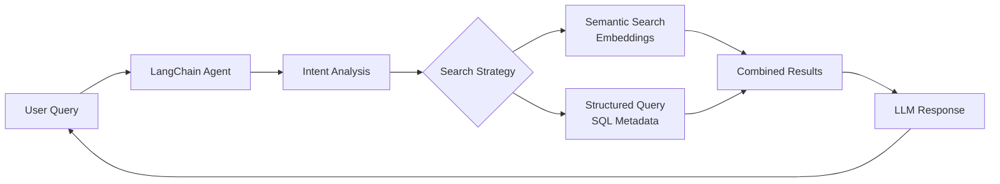

# Interactive CV Project - CLAUDE.md

## Project Overview

This project creates an **Interactive CV System** that transforms academic research papers and personal chronicle notes into a dynamic, queryable professional profile. The system uses AI to extract metadata, build a knowledge graph, and enable intelligent conversations about your research expertise and work history.

**Core Purpose**: Build a RAG-powered interactive CV that can answer questions about your research, skills, and experience by analyzing your academic papers and daily notes.

## System Architecture

### Data Sources
1. **Academic Papers** (`/academic/`)
   - Paper transcripts (PDFs → Markdown)
   - Detailed analyses of each paper
   - Mathematical concepts, methods, applications

2. **Chronicle Notes** (`/chronicle/`)
   - Daily notes with work progress
   - Weekly/monthly summaries
   - Project updates and insights

### Metadata System Design

We chose a **single-source SQLite database** approach for all metadata:

```sql
-- Core schema
CREATE TABLE documents (
    id INTEGER PRIMARY KEY,
    file_path TEXT UNIQUE NOT NULL,
    doc_type TEXT NOT NULL,  -- 'chronicle' or 'academic'
    title TEXT,
    date DATE,
    content_hash TEXT,  -- For change detection
    metadata JSON,  -- Flexible metadata storage
    embedding BLOB  -- Vector embeddings for RAG
);

-- Relationship tables for topics, people, projects
CREATE TABLE topics (id, name);
CREATE TABLE people (id, name);
CREATE TABLE projects (id, name);
```

### Enhanced Templates

We've created metadata-rich templates for chronicle notes:

```yaml
# Daily Note Template
---
date: {{date}}
topics: []  # [optimal-transport, machine-learning]
people: []  # Collaborators mentioned
projects: []  # Active projects
papers: []  # Papers referenced
tools: []  # Technologies used
insights: []  # Key breakthroughs
---
```

### LangChain Agent with OpenRouter

We use LangChain with OpenRouter (Gemini 2.5 Flash) for intelligent metadata extraction. After testing multiple prompt strategies, we refined the approach to focus on research connections and technical achievements:

```python
from langchain_openai import ChatOpenAI
from dotenv import load_dotenv

load_dotenv()

llm = ChatOpenAI(
    base_url="https://openrouter.ai/api/v1",
    api_key=os.getenv("OPENROUTER_API_KEY"),
    model="google/gemini-2.5-flash",
    default_headers={
        "HTTP-Referer": "http://localhost:3000",
        "X-Title": "Interactive CV Metadata Extractor",
    }
)
```

**Prompt Testing Results**: We tested three prompt approaches and selected the Research-Focused variant that captures the most comprehensive project details and technical insights.

## Implementation Progress

### ✅ Completed
1. **Project Structure**: Set up directories and initial files
2. **Template Enhancement**: Created metadata-rich daily/weekly/monthly templates
3. **Academic Analysis**: Completed comprehensive analysis of all research papers
4. **Metadata Schema Design**: Defined extraction patterns for both academic and chronicle data
5. **LangChain Integration**: Built and tested metadata extractor with OpenRouter and Gemini 2.5 Flash
6. **Prompt Optimization**: Tested multiple prompt strategies and improved people extraction
7. **SQLite Database**: Created database with proper schema, indexes, and relationships
8. **Metadata Extraction System**: Built base extractor with change detection and transaction support
9. **Chronicle Integration**: Integrated LLM extractor with database storage
10. **Sync-Based System**: Replaced file watcher with unified sync script that handles files + metadata
11. **Academic Import**: Successfully imported 12 papers with comprehensive metadata
12. **Query Tools**: Created comprehensive database query scripts
13. **Embeddings System**: Added OpenAI embeddings for all documents and chunks
14. **Remote Sync**: Automatic sync of files and database to portfolio-ts54
15. **Knowledge Graph**: Interactive visualization with 209 nodes and 264 relationships
16. **Database Cleanup**: Fixed person name extraction issues
17. **Visualization Tools**: Datasette for DB exploration, vis.js for graph visualization
18. **Graph-Enhanced Queries**: Combined SQL + graph traversal for intelligent queries

### 📋 TODO
1. **Query API**: REST/GraphQL interface for searching and retrieving information
2. **RAG Pipeline**: Connect embeddings to LLM for intelligent responses
3. **Web Interface**: Frontend for interactive CV queries
4. **Production Deployment**: Set up on remote server

## Key Design Decisions

### Why SQLite?
- Single source of truth
- Efficient querying with SQL
- Handles relationships well (topics, people, projects)
- Easy backup and migration
- Supports JSON fields for flexible metadata

### Why Separate Academic/Chronicle Processing?
- **Academic**: Rarely changes, one-time bulk extraction
- **Chronicle**: Daily updates, needs file watcher
- Different metadata schemas and extraction strategies

### Why LangChain + OpenRouter?
- Unified API for multiple LLMs
- Gemini 2.5 Flash: Fast and cost-effective for metadata extraction
- Structured output with Pydantic schemas
- Easy to switch models if needed

## Metadata Extraction Strategy

### Academic Papers
Extract comprehensive metadata including:
- Mathematical concepts and methods
- Key innovations and contributions
- Applications and practical impact
- Collaborators and research connections
- Limitations and future directions

### Chronicle Notes
Use LLM to extract nuanced metadata:
- Work focus and project progress
- Technical breakthroughs with context
- Problems solved and solutions
- Learning moments and insights
- Connections to academic research

## RAG Architecture



## Usage Examples

### Query Examples
- "What papers has Vaios written about optimal transport?"
- "Show me his experience with neural networks"
- "When did he work on reinforcement learning projects?"
- "What are his key mathematical contributions?"

### Expected Responses
The system combines:
- Formal expertise from academic papers
- Practical experience from daily notes
- Project progress and collaborations
- Personal insights and learning journey

## File Structure
```
/interactive_cv/
├── academic/               # Research papers and analyses
├── chronicle/              # Daily/weekly notes (synced from Obsidian)
├── metadata_system/        # Core extraction and query code
│   ├── extractors/         # Base and chronicle extractors
│   ├── scripts/            # Import and setup scripts
│   ├── embeddings.py       # Vector embedding generation
│   ├── metadata.db         # SQLite database (not in git)
│   └── query_comprehensive.py  # Database exploration tool
├── .sync/                  # Sync scripts
│   ├── sync-chronicle      # Shell wrapper
│   └── sync_chronicle_with_metadata.py  # Main sync logic
├── metadata_extractor.py   # LLM metadata extraction
├── requirements.txt        # Python dependencies
├── note.md                 # Core ideas and decisions
├── CLAUDE.md              # This file
├── cleanup_people.py       # Database cleanup utilities
├── view_database.sh        # Launch Datasette viewer
└── VISUALIZATION.md        # Visualization tools guide
```

## Current Status

### Database Contents
- **20 documents total**: 12 academic papers + 8 chronicle notes
- **170 unique topics**: Mathematical concepts, research areas, and project tags
- **18 projects**: From daily work (Collapsi RL, Interactive CV, etc.)
- **1 person**: Mark S. Ball (cleaned from incomplete entries)
- **113 semantic chunks**: From academic paper analyses
- **All content has embeddings**: For semantic search capabilities
- **209 knowledge graph nodes**: With 264 edges showing relationships
- **Major research areas**: Optimal transport (7 papers), Stochastic control (3), Probability theory (3)

### Key Files
- `metadata_system/metadata.db`: SQLite database with all metadata
- `.sync/sync_chronicle_with_metadata.py`: Main sync script with metadata extraction
- `.sync/sync-chronicle`: Shell wrapper for easy execution
- `metadata_system/query_comprehensive.py`: Query tool to explore database
- `metadata_system/scripts/import_*.py`: Import scripts for academic data
- `metadata_extractor.py`: LLM-based metadata extraction (with improved prompts)
- `metadata_system/knowledge_graph.py`: Generate interactive knowledge graph
- `metadata_system/graph_enhanced_query.py`: Graph-aware query system
- `metadata_system/knowledge_graph.html`: Interactive visualization (vis.js)

## Usage

### Chronicle Sync Commands
After setting up, use these commands from anywhere:

```bash
# Regular sync with metadata extraction
chronicle

# Dry run - see what would change
chronicle-dry

# Force re-extraction of all metadata
chronicle-force

# Check sync configuration
chronicle-status
```

### What the sync does:
1. Syncs from Obsidian Chronicles folder to local
2. Detects new/changed files using content hashes
3. Extracts metadata using LLM (topics, people, projects)
4. Generates embeddings for semantic search
5. Syncs both files and database to remote server

## Visualization & Analysis

### Database Viewer
```bash
./view_database.sh  # Launches Datasette on http://localhost:8001
```

### Knowledge Graph
```bash
python3 metadata_system/knowledge_graph.py  # Generate/update graph
# Open metadata_system/knowledge_graph.html in browser
```

### Graph Statistics
- 209 nodes (documents, topics, people, projects)
- 264 edges showing relationships
- Interactive visualization with color-coded node types
- PageRank identifies most connected/important nodes

## Next Steps

1. **Query API Development**: Build REST/GraphQL API using graph-enhanced queries
2. **RAG Pipeline**: Integrate graph context with embeddings for smarter responses
3. **Web Interface**: Create interactive frontend for CV queries
4. **Production Deployment**: Deploy on remote server

## Development Notes

- Use `uv` for package management
- Store API keys in `.env` file (OPENROUTER_API_KEY and OPENAI_API_KEY required)
- Test with small batches before full processing
- Monitor OpenRouter usage and costs
- Keep metadata extraction prompts focused and specific
- Database uses relative paths - run scripts from project root
- Sync uses content hashing to detect changes
- LLM extraction happens automatically for new/modified chronicle files
- Remote sync includes database backup for safety
- Malformed notes are skipped gracefully
- LLM prompts now enforce proper name extraction (no placeholders)
- Knowledge graph provides relationship insights beyond SQL queries

## Integration Points

The system is designed to integrate with:
- Static site generators for web deployment
- Vector databases for enhanced search
- Additional LLM providers via OpenRouter
- Export formats (PDF, JSON, API)

---

*This Interactive CV system transforms a static professional profile into a living, intelligent representation of research expertise and career journey.*