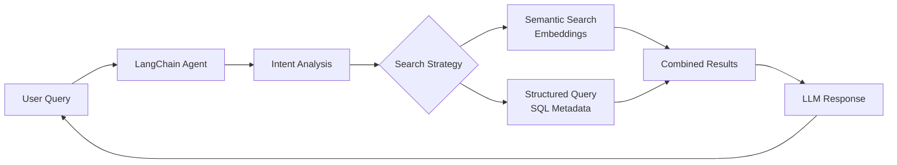

# Interactive CV Project - CLAUDE.md

## Recent Major Refactoring (2025-01-04)

### Database System Overhaul
We completely redesigned the database structure for cleaner, more efficient data management:

1. **Renamed `metadata_system/` → `DB/`** for simplicity
2. **Normalized Database Schema**:
   - Single unified `relationships` table (no more redundancy!)
   - Enhanced entity tables with proper attributes
   - Pre-computed `graph_nodes` and `graph_edges` tables for performance
   - Direct entity/relationship creation during extraction
3. **Modular Extraction Workflow**: 
   - Extractors generate JSON metadata files
   - Unified populator imports JSON to database
   - Separation of concerns for better debugging

### Agents System Architecture
1. **Two-Step Academic Workflow**:
   - **Academic Analyzer**: Analyzes raw papers following `How_to_analyze.md` methodology → produces structured analyses
   - **Academic Metadata Extractor**: Extracts entities/relationships from analyses (not raw papers) to JSON
2. **Personal Notes Extractor**: Processes daily/weekly notes to JSON
3. **Unified Database Population**: Single script imports all JSON metadata

### Complete Processing Pipeline (NEW!)
We now have a complete pipeline that includes chunking and embeddings:

1. **Document Chunking**: Smart semantic chunking (1000-1500 tokens) with section preservation
2. **Entity-Chunk Mapping**: Maps which entities appear in each chunk
3. **Multi-Level Embeddings**: Generated for documents, chunks, AND entities
4. **Database Management Scripts**: `DB/build_database.py` and `DB/update_database.py` handle all operations

**Key Insight**: The system now implements the full RAG architecture with proper chunking, enabling efficient semantic search at multiple granularities.

## Project Overview

This project creates an **Interactive CV System** that transforms academic research papers and personal notes into a dynamic, queryable professional profile. The system uses AI to extract metadata, build a knowledge graph, and enable intelligent conversations about your research expertise and work history.

**Core Purpose**: Build a RAG-powered interactive CV that can answer questions about your research, skills, and experience by analyzing your academic papers and daily notes.

## System Architecture

### Data Sources
1. **Academic Papers** (`/academic/`)
   - Paper transcripts (PDFs → Markdown)
   - Detailed analyses of each paper
   - Mathematical concepts, methods, applications

2. **Personal Notes** (`/personal_notes/`)
   - Daily notes with work progress
   - Weekly summaries
   - Project updates and insights

### Database System Design

We use a **normalized SQLite database** with clean entity-relationship structure:

**Core Tables:**
- **Document Tables**: 
  - `chronicle_documents`: Daily/weekly notes from personal notes
  - `academic_documents`: Research papers and analyses
  - `documents`: Unified view for backward compatibility
- **Entity Tables** (with attributes):
  - `topics`: Mathematical concepts, research areas (name, category, description)
  - `people`: Authors, collaborators (name, role, affiliation)
  - `projects`: Research projects (name, description, dates)
  - `institutions`: Universities, research centers (name, type, location)
  - `methods`: Algorithms, techniques (name, category, description)
  - `applications`: Real-world uses (name, domain, description)
- **Relationship & Graph**:
  - `relationships`: Single unified table for ALL connections (no redundancy!)
  - `graph_nodes` & `graph_edges`: Pre-computed for visualization
  - `document_chunks`: Semantic segments for RAG
  - `chunk_entities`: Maps entities to chunks
  - `embeddings`: Vector storage for all entities

**Design Principles:**
- Single source of truth (no duplicate data)
- Direct extraction to database (no intermediate JSON processing)
- Graph-ready structure with pre-computed metrics
- Flexible JSON metadata fields for extensibility
- Unified ID format: `{type}_{id}` (e.g., 'academic_1', 'chronicle_2')

### Chunking and Extraction Strategy

**Core Principle**: Extraction needs context, retrieval needs focus.

We use a multi-stage pipeline that preserves full context during extraction while enabling efficient retrieval:

1. **Full Document Analysis**: LLM analyzes complete paper (all 3 phases)
2. **Entity Extraction**: Extract from FULL analysis (sees complete context)
3. **Database Population**: Store entities and relationships atomically
4. **Smart Chunking**: Split AFTER extraction into 1000-1500 token chunks
5. **Entity Mapping**: Map which entities appear in each chunk
6. **Embeddings**: Generate for documents, chunks, and entities

**Why This Order Matters**:
- Extraction catches cross-document references and relationships
- Chunking preserves semantic boundaries
- Each chunk knows its entities (no re-extraction needed)
- Queries can use entities, embeddings, or both

### Enhanced Templates

We've created metadata-rich templates for chronicle notes:

```yaml
# Daily Note Template
---
date: {{date}}
topics: []  # [optimal-transport, machine-learning]
people: []  # Collaborators mentioned
projects: []  # Active projects
papers: []  # Papers referenced
tools: []  # Technologies used
insights: []  # Key breakthroughs
---
```

### LangChain Agent with OpenRouter

We use LangChain with OpenRouter (Gemini 2.5 Flash) for intelligent metadata extraction. After testing multiple prompt strategies, we refined the approach to focus on research connections and technical achievements:

```python
from langchain_openai import ChatOpenAI
from dotenv import load_dotenv

load_dotenv()

llm = ChatOpenAI(
    base_url="https://openrouter.ai/api/v1",
    api_key=os.getenv("OPENROUTER_API_KEY"),
    model="google/gemini-2.5-flash",
    default_headers={
        "HTTP-Referer": "http://localhost:3000",
        "X-Title": "Interactive CV Metadata Extractor",
    }
)
```

**Prompt Testing Results**: We tested three prompt approaches and selected the Research-Focused variant that captures the most comprehensive project details and technical insights.

## Implementation Progress

### ✅ Completed
1. **Project Structure**: Set up directories and initial files
2. **Template Enhancement**: Created metadata-rich daily/weekly/monthly templates
3. **Academic Analysis**: Completed comprehensive analysis of all research papers
4. **Metadata Schema Design**: Defined extraction patterns for both academic and chronicle data
5. **LangChain Integration**: Built and tested metadata extractor with OpenRouter and Gemini 2.5 Flash
6. **Prompt Optimization**: Tested multiple prompt strategies and improved people extraction
7. **SQLite Database**: Created database with proper schema, indexes, and relationships
8. **Metadata Extraction System**: Built base extractor with change detection and transaction support
9. **Chronicle Integration**: Integrated LLM extractor with database storage
10. **Sync-Based System**: Replaced file watcher with unified sync script that handles files + metadata
11. **Academic Import**: Successfully imported 12 papers with comprehensive metadata
12. **Query Tools**: Created comprehensive database query scripts
13. **Embeddings System**: Added OpenAI embeddings for all documents and chunks
14. **Remote Sync**: Automatic sync of files and database to portfolio-ts54
15. **Knowledge Graph**: Interactive visualization with 965 nodes and 2232 edges
16. **Database Cleanup**: Fixed person name extraction issues
17. **Visualization Tools**: Datasette for DB exploration, vis.js for graph visualization
18. **Graph-Enhanced Queries**: Combined SQL + graph traversal for intelligent queries
19. **Database Restructuring**: Split documents table into chronicle_documents and academic_documents
20. **Knowledge Graph Refactoring**: Made completely database-agnostic and consolidated into single file
21. **Institution Support**: Added institutions as first-class entities with proper relationships
22. **Academic Pipeline**: Complete extraction and population workflow
23. **Profile Documentation**: Academic profile and CV generation in Profile/ directory
24. **Database Organization**: Moved populate_graph_tables.py to DB folder for better organization
25. **Complete Pipeline**: DB/build_database.py and DB/update_database.py handle everything
26. **Entity Deduplication System**: Implemented multi-level duplicate detection with LLM verification

### 📋 TODO
1. **Embeddings Regeneration**: Generate embeddings for all entities and chunks (DB structure ready)
2. **Query API**: REST/GraphQL interface for searching and retrieving information
3. **RAG Pipeline**: Complete integration with conversational interface
4. **Web Interface**: Complete interactive frontend for CV queries
5. **Production Deployment**: Set up on remote server

## Key Design Decisions

### Why SQLite?
- Single source of truth
- Efficient querying with SQL
- Handles relationships well (topics, people, projects)
- Easy backup and migration
- Supports JSON fields for flexible metadata

### Why Separate Academic/Personal Notes Processing?
- **Academic**: Rarely changes, one-time bulk extraction
- **Personal Notes**: Daily updates, frequent changes
- Different metadata schemas and extraction strategies

### Why LangChain + OpenRouter?
- Unified API for multiple LLMs
- Gemini 2.5 Flash: Fast and cost-effective for metadata extraction
- Structured output with Pydantic schemas
- Easy to switch models if needed

## Metadata Extraction Strategy

### Academic Papers
Extract comprehensive metadata including:
- Mathematical concepts and methods
- Key innovations and contributions
- Applications and practical impact
- Collaborators and research connections
- Limitations and future directions

### Personal Notes
Use LLM to extract nuanced metadata:
- Work focus and project progress
- Technical breakthroughs with context
- Problems solved and solutions
- Learning moments and insights
- Connections to academic research

## RAG Architecture



## Usage Examples

### Query Examples
- "What papers has Vaios written about optimal transport?"
- "Show me his experience with neural networks"
- "When did he work on reinforcement learning projects?"
- "What are his key mathematical contributions?"

### Expected Responses
The system combines:
- Formal expertise from academic papers
- Practical experience from daily notes
- Project progress and collaborations
- Personal insights and learning journey

## File Structure
```
/interactive_cv/
├── academic/               # Research papers and analyses
├── personal_notes/         # Daily/weekly notes
├── DB/                     # Database and extraction system
│   ├── extractors/         # Base and specialized extractors
│   ├── build_database.py   # Build database from scratch
│   ├── update_database.py  # Update database incrementally
│   ├── embeddings.py       # Vector embedding generation
│   ├── chunker.py          # Smart document chunking
│   ├── unified_metadata_populator.py  # Import JSON to DB
│   ├── populate_graph_tables.py  # Graph table populator
│   ├── metadata.db         # SQLite database (not in git)
│   ├── query_comprehensive.py  # Database exploration tool
│   └── README.md           # Comprehensive DB architecture docs
├── KG/                     # Knowledge Graph system
│   ├── knowledge_graph.py  # Graph builder from database
│   └── graph_enhanced_query.py  # Graph-aware query system
├── agents/                 # LLM analyzers and extractors
│   ├── academic_analyzer.py  # Academic paper analyzer
│   ├── academic_metadata_extractor.py  # Extract to JSON
│   └── chronicle_metadata_extractor.py  # Chronicle extractor
├── scripts/                # Utility scripts
│   ├── extract_academic_metadata.py  # Batch academic extraction
│   └── extract_personal_notes_metadata.py  # Batch chronicle extraction
├── Profile/                # Academic profile documents
│   ├── Profile.md          # Detailed academic profile
│   └── cv.md              # Generated CV
├── .sync/                  # Sync scripts
│   ├── sync-chronicle      # Shell wrapper
│   └── sync_chronicle_with_metadata.py  # Main sync logic
├── interactive_agent.py    # Conversational interface
├── requirements.txt        # Python dependencies
├── view_database.sh        # Launch Datasette viewer
├── README.md              # Project overview
└── CLAUDE.md              # This file (detailed documentation)
```

## Current Status

### Database Status (Updated 2025-01-04)
- **Database**: Fully populated with academic papers and personal notes
- **Academic Papers**: 12 papers successfully processed
- **Chronicle Notes**: 7 notes (6 daily, 1 weekly)
- **Entities Extracted (after deduplication)**:
  - 542 topics (was 577): Mathematical concepts, research areas, technical topics
  - 174 people (was 175): Authors, researchers, and collaborators
  - 114 methods (was 132): Analytical and computational techniques
  - 24 institutions: Universities and research centers
  - 24 applications (was 25): Real-world use cases
  - 8 projects (was 13): Research and development projects
- **Document Processing**:
  - 65 semantic chunks created
  - 0 embeddings generated (needs generation)
  - 1038 relationships established
- **Knowledge Graph**: 905 nodes (was 965) and 2594 edges (was 2232)
  - 60 duplicates removed (6.2% reduction)
  - Edge count increased due to merged relationships
- **Pipeline Status**: ✅ Extraction complete, ✅ Graph populated, ✅ Deduplication complete, ⏳ Embeddings needed

### Processing Results
- All 12 papers + 7 personal notes analyzed and stored
- Comprehensive metadata extracted using LLMs
- Database fully populated with entities and relationships
- Knowledge graph fully populated with 965 nodes and 2232 edges
- Embeddings need generation for semantic search (run `python DB/build_database.py`)

### Key Files
- `DB/metadata.db`: SQLite database with all metadata (✅ created and populated)
- `DB/build_database.py`: Build database from scratch with complete pipeline
- `DB/update_database.py`: Update database with new documents incrementally
- `DB/unified_metadata_populator.py`: Import JSON metadata to database
- `DB/chunker.py`: Smart semantic document chunking
- `agents/academic_analyzer.py`: Analyzes papers following How_to_analyze.md
- `agents/academic_metadata_extractor.py`: Extracts entities from analyses to JSON
- `agents/chronicle_metadata_extractor.py`: Extracts chronicle metadata to JSON
- `.sync/sync_chronicle_with_metadata.py`: Main sync script with metadata extraction
- `.sync/sync-chronicle`: Shell wrapper for easy execution
- `DB/query_comprehensive.py`: Query tool to explore database
- `DB/embeddings.py`: Vector embedding generation
- `KG/knowledge_graph.py`: Database-agnostic graph generator
- `KG/graph_enhanced_query.py`: Graph-aware query system
- `KG/knowledge_graph.json`: Generated graph data (✅ populated with 965 nodes)
- `web_ui/index.html`: Interactive visualization (vis.js)
- `interactive_agent.py`: Conversational AI interface
- `DB/populate_graph_tables.py`: Populates graph_nodes and graph_edges tables

## Usage

### Database Management (Updated 2025-01-04)

We now have two dedicated database management scripts in the DB folder:

```
Metadata JSONs → Database → Chunks → Entity Mappings → Embeddings → Knowledge Graph
```

#### 1. Build Database from Scratch
```bash
# Complete rebuild with all features
cd DB
python build_database.py

# This script:
# 1. Creates fresh database with proper schema
# 2. Imports all metadata from JSON files
# 3. Chunks documents intelligently (1000-1500 tokens)
# 4. Maps entities to chunks for granular search
# 5. Generates embeddings at all levels (docs, chunks, entities)
# 6. Updates graph tables

# Options:
python build_database.py --backup              # Backup existing database first
python build_database.py --skip-embeddings     # Skip embedding generation
python build_database.py --skip-graph          # Skip graph population
```

#### 2. Update Database with New Documents
```bash
# Add only new documents (incremental update)
cd DB
python update_database.py

# This script:
# 1. Scans for new metadata files not in database
# 2. Imports only new documents
# 3. Creates chunks for new documents
# 4. Generates embeddings for new content
# 5. Updates graph with new relationships

# Options:
python update_database.py --skip-embeddings    # Skip embedding generation
python update_database.py --skip-graph         # Skip graph update
```

#### Metadata Extraction (if needed)
```bash
# Extract personal notes metadata to JSON (academic already done)
python scripts/extract_personal_notes_metadata.py
# Creates JSON files in raw_data/personal_notes/extracted_metadata/
```

#### Why Modular?
1. **Separation of Concerns**: Extraction logic separate from storage
2. **Inspectable Data**: Review JSON metadata before database import
3. **Flexibility**: Re-run database population without re-extracting
4. **Consistency**: Academic and chronicle follow same pattern
5. **Debugging**: Easy to see what was extracted

#### Key Components
- `agents/academic_metadata_extractor.py` - Extracts academic metadata → JSON
- `agents/chronicle_metadata_extractor.py` - Extracts personal notes metadata → JSON
- `scripts/extract_academic_metadata.py` - Batch extraction for academic papers
- `scripts/extract_personal_notes_metadata.py` - Batch extraction for personal notes
- `DB/unified_metadata_populator.py` - Populates DB from JSON files
- `DB/chunker.py` - Smart document chunking with section preservation
- `DB/build_database.py` - Build database from scratch with complete pipeline
- `DB/update_database.py` - Update database with new documents incrementally
- `DB/populate_graph_tables.py` - Populate graph tables from existing data

### Chunking Strategy

The chunking system (`DB/chunker.py`) implements intelligent document segmentation:

1. **Section-Aware**: Preserves markdown sections and headers
2. **Semantic Boundaries**: Chunks at paragraph boundaries when possible
3. **Optimal Size**: 1000-1500 tokens per chunk with 200 token overlap
4. **Entity Preservation**: Maps entities to the chunks they appear in
5. **Metadata Rich**: Each chunk knows its section and position

This enables efficient RAG by retrieving only relevant chunks instead of full documents.

### Chronicle Sync Commands
After setting up, use these commands from anywhere:

```bash
# Regular sync with metadata extraction
chronicle

# Dry run - see what would change
chronicle-dry

# Force re-extraction of all metadata
chronicle-force

# Check sync configuration
chronicle-status
```

### What the sync does:
1. Syncs from Obsidian Chronicles folder to local
2. Detects new/changed files using content hashes
3. Extracts metadata using LLM (topics, people, projects)
4. Generates embeddings for semantic search
5. Syncs both files and database to remote server

## Visualization & Analysis

### Database Viewer (Datasette)
```bash
./view_database.sh  # Launches Datasette on http://localhost:8001
```

Features:
- Browse all tables interactively
- Run SQL queries with autocomplete
- Export data in JSON/CSV formats
- Automatic API generation for queries
- Faceted search and filtering

### Knowledge Graph
```bash
# Generate/update graph (provide database path)
python3 KG/knowledge_graph.py DB/metadata.db
# Creates KG/knowledge_graph.json (required for queries)
```

Graph Statistics:
- **Current**: 905 nodes, 2594 edges (✅ fully populated, deduplicated)
- **Node Types**:
  - 12 academic documents
  - 7 chronicle documents
  - 542 topics (was 577)
  - 174 people (was 175)
  - 114 methods (was 132)
  - 24 institutions
  - 24 applications (was 25)
  - 8 projects (was 13)
- Interactive visualization with color-coded node types:
  - 🔴 Documents (red) - split into academic_document and chronicle_document
  - 🔵 Topics (blue)
  - 🟢 People (green)
  - 🟠 Projects (orange)
  - 🟣 Methods (purple)
  - 🏛️ Institutions (teal)
- PageRank identifies most connected nodes:
  - Vaios Laschos (top person node)
  - Calculus of Variations (top topic)
  - Optimal Transport (key research area)
- Configurable via schema-driven extraction approach

### Alternative Desktop Tools
- **DB Browser for SQLite**: `sudo apt install sqlitebrowser`
- **DBeaver**: Professional database tool from https://dbeaver.io/

## Interactive Agent

An intelligent conversational agent that answers questions about research and professional journey using LangChain.

### Setup
```bash
# Ensure API keys are in .env:
# OPENROUTER_API_KEY=your_key_here
# OPENAI_API_KEY=your_key_here

# Run the agent
python interactive_agent.py
```

### Features
- Multi-tool architecture with specialized query tools
- Memory management for conversation history
- Semantic search using embeddings
- Knowledge graph integration for deeper insights
- Real-time streaming responses

### Available Tools
1. **search_academic_papers**: Find papers by topic or keywords
2. **search_chronicle_notes**: Search daily work notes
3. **find_research_topics**: Discover research areas
4. **get_research_evolution**: Track topic evolution over time
5. **find_project_connections**: Explore project relationships
6. **semantic_search**: Natural language search
7. **get_collaborations**: Find collaboration patterns

### Example Questions
- "What papers has Vaios written about optimal transport?"
- "Show me his recent work on machine learning"
- "How has his research evolved from mathematics to AI?"
- "What projects involve reinforcement learning?"
- "Find papers related to GANs or neural networks"
- "What did he work on in June 2025?"

## Profile Directory

The `Profile/` directory contains generated academic profile documents:

- **Profile.md**: Comprehensive academic profile including:
  - Executive summary of research expertise
  - Core competencies in theoretical and applied areas
  - Methodological toolkit and computational approaches
  - Key publications and contributions
  - Research impact and future directions

- **cv.md**: Traditional CV format with:
  - Educational background
  - Research experience
  - Publications list
  - Teaching and supervision
  - Skills and expertise

These documents are automatically generated from the database and can be exported for various uses.

## Next Steps

1. **Embeddings Generation**: Generate embeddings for all entities and chunks
2. **Query API**: REST/GraphQL interface for searching and retrieving information
3. **RAG Pipeline**: Complete integration with conversational interface
4. **Web Interface**: Complete interactive frontend for CV queries
5. **Production Deployment**: Deploy on remote server

## Development Notes

- Use `uv` for package management
- Store API keys in `.env` file (OPENROUTER_API_KEY and OPENAI_API_KEY required)
- Test with small batches before full processing
- Monitor OpenRouter usage and costs
- Keep metadata extraction prompts focused and specific
- Database uses relative paths - run scripts from project root
- Sync uses content hashing to detect changes
- LLM extraction happens automatically for new/modified chronicle files
- Remote sync includes database backup for safety
- Malformed notes are skipped gracefully
- LLM prompts now enforce proper name extraction (no placeholders)
- Knowledge graph provides relationship insights beyond SQL queries
- Database split: documents table now separated into chronicle_documents and academic_documents
- Institutions are now first-class entities with their own table
- Knowledge graph system is now completely database-agnostic (single file: knowledge_graph.py)
- Backward compatibility maintained through documents_view for queries
- No hardcoded SQL - works with any database following the naming conventions
- Graph table population script moved to DB folder for better organization
- All database operations centralized in DB folder with comprehensive README

## Architecture Insights

### Why Database-First Design?

The system evolved from file-based to database-centric for several reasons:

1. **Relationship Management**: Files can't efficiently represent many-to-many relationships
2. **Query Performance**: SQL indexes beat file searching for complex queries
3. **Data Integrity**: Transactions ensure consistent state
4. **Scalability**: Can grow to thousands of documents without degrading

### The Power of Pre-computed Graph Tables

Instead of building the graph on-the-fly, we pre-compute nodes and edges:
- **Fast Visualization**: Sub-second rendering of 965 nodes
- **Efficient Traversal**: Graph algorithms work on optimized structures
- **Flexible Weights**: Edge weights based on co-occurrence and confidence
- **Easy Updates**: Incremental changes without full rebuild

### Modular Pipeline Benefits

1. **Inspect Before Import**: JSON files allow reviewing extracted data
2. **Rerun Without Re-extraction**: Database rebuild doesn't need LLM calls
3. **Mix Sources**: Academic and personal notes follow same flow
4. **Debug Easily**: Each stage produces visible output

## Entity Deduplication System

### The Problem
During extraction, entities can be duplicated due to:
- **Case variations**: "Machine Learning" vs "machine learning"
- **Abbreviations**: "V. Laschos" vs "Vaios Laschos"
- **Naming variations**: "Optimal Transport" vs "Optimal Transport (OT)"
- **Extraction errors**: Long strings miscategorized as topics

### The Solution
A sophisticated multi-level deduplication system with transitive clustering:

1. **Database Verification** (`DB/verify_entities.py`)
   - Shows entity statistics and samples
   - Detects exact and fuzzy duplicates
   - Identifies suspicious entities (overly long names)
   - Exports duplicate reports

2. **Entity Embeddings** (`DB/embeddings.py`)
   - Generates embeddings for all entities with context
   - Interactive verification mode (`--verify` flag)
   - Shows samples before processing
   - Enables semantic similarity search

3. **Enhanced Deduplication Agent** (`agents/entity_deduplicator.py`)
   - **String Matching**: Exact and fuzzy string comparison
   - **Embedding Similarity**: Cosine similarity on entity vectors
   - **Transitive Clustering**: Groups chains of duplicates (e.g., A→B→C all merge together)
   - **Parallel LLM Verification**: Up to 20 workers for fast processing
   - **Smart Canonical Selection**: Chooses best entity based on:
     - Relationship count (most connected wins)
     - Proper capitalization preferred
     - No kebab-case or underscores
     - Proper spacing after punctuation
     - Length (more complete names)
     - Additional metadata presence
   - **Conflict Resolution**: Handles duplicate relationships during merge

### Deduplication Workflow
```bash
# 1. Check current state
python DB/verify_entities.py

# 2. Generate embeddings with verification
python DB/embeddings.py --entities-only --verify

# 3. Find duplicates (dry run)
python agents/entity_deduplicator.py --dry-run

# 4. Full deduplication with clustering and parallel processing
python agents/entity_deduplicator.py --parallel-workers 20 --merge --backup

# 5. Update graph
python DB/populate_graph_tables.py
```

### Updated Workflow with New Options
```bash
# Maximum parallel processing (20 workers)
python agents/entity_deduplicator.py --parallel-workers 20 --merge --backup

# Disable clustering (not recommended - misses transitive duplicates)
python agents/entity_deduplicator.py --no-clustering --merge --backup

# Process only specific entity type
python agents/entity_deduplicator.py --entity-type topic --merge
```

### Design Principles
- **Safety First**: Dry-run by default, requires explicit --merge
- **Context Aware**: LLM knows about Vaios' research domain
- **Cost Efficient**: Batch processing, cheap model (Gemini Flash), parallel verification
- **Audit Trail**: Complete log of all deduplication actions
- **Entity-Specific**: Different thresholds for different entity types
- **Transitive Completeness**: Finds all connected duplicates, not just pairs

### Implementation Details
- **`find_duplicate_clusters()`**: Groups transitively connected duplicates using DFS
- **`choose_canonical_entity()`**: Scores entities to pick the best one from a cluster
- **`verify_duplicates_parallel()`**: Parallel LLM verification using ThreadPoolExecutor
- **`merge_cluster()`**: Merges entire clusters instead of just pairs
- **Relationship conflict handling**: Prevents UNIQUE constraint violations during merge

### Deduplication Results
- **Total**: 965 → 905 nodes (60 duplicates removed, 6.2% reduction)
- **Topics**: 577 → 542 (35 removed)
- **Projects**: 13 → 8 (5 removed)
- **Methods**: 132 → 114 (18 removed)
- **People**: 175 → 174 (1 removed)
- **Applications**: 25 → 24 (1 removed)
- **Edges increased**: 2232 → 2594 (merged entities combine relationships)

## Integration Points

The system is designed to integrate with:
- Static site generators for web deployment
- Vector databases for enhanced search
- Additional LLM providers via OpenRouter
- Export formats (PDF, JSON, API)

---

*This Interactive CV system transforms a static professional profile into a living, intelligent representation of research expertise and career journey.*