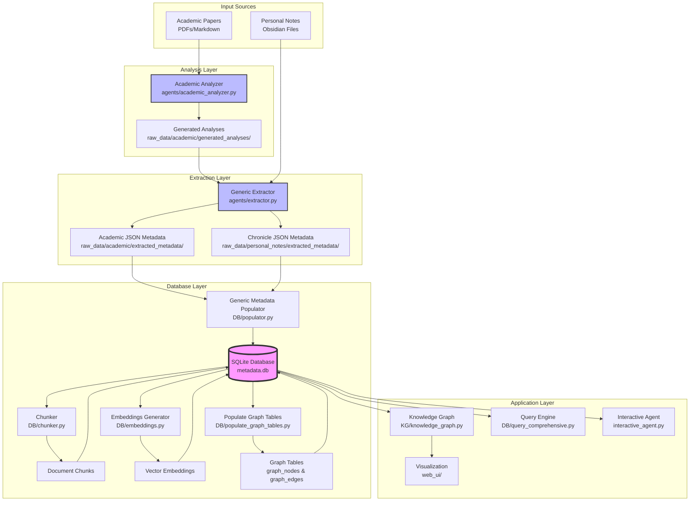

# Database System Architecture

## Overview

The DB folder contains the complete database infrastructure for the Interactive CV system. It implements a **revolutionary configuration-driven architecture** that transforms raw documents into a queryable knowledge graph with semantic search capabilities.

### 🎯 Revolutionary Design: Configuration-First Architecture

The system uses a **configuration-driven approach** that fundamentally separates domain knowledge from code:

```
YAML Blueprints → Generic Code → Rich Knowledge Graph (24+ Node Types)
```

**Key Innovation**: The entire database system is **domain-agnostic** and works with any research field without code changes. All extraction rules, database mappings, and visualization settings are defined in YAML configuration files in the `blueprints/` directory.

## System Architecture



## Core Components

### 1. **Database Schema** (`metadata.db`)

The database uses a **configuration-driven normalized design** with schema generated from `blueprints/core/database_schema.yaml`:

#### Document Tables
- **`academic_documents`**: Research papers with title, date, domain, document_type, content
- **`chronicle_documents`**: Personal notes with title, date, note_type, content
- **`documents`**: Unified view for backward compatibility

#### Entity Tables (Rich Categorization - 24+ Types)
- **`topics`**: Research areas and concepts (name, **category**, description) - **24+ distinct categories**
  - `math_foundation` (203 nodes): Core mathematical concepts like "Optimal Transport"
  - `research_insight` (93): Key insights and discoveries
  - `research_area` (47): Research domains and fields
  - `personal_achievement` (71): Work accomplishments and progress
  - And 20+ more specialized categories
- **`people`**: Authors and collaborators (name, role, affiliation)
- **`projects`**: Research and development projects (name, description, dates, status)
- **`institutions`**: Universities and research centers (name, type, location)
- **`methods`**: Algorithms and techniques with rich categorization:
  - `theoretical_method` (25): Proof techniques, analytical approaches
  - `computational_method` (2): Numerical and algorithmic techniques
  - `analytical_method` (22): Analysis and evaluation methods
  - `general_method` (28): General techniques and approaches
  - `algorithmic_method` (23): Specific algorithms and procedures
- **`applications`**: Real-world use cases (name, domain, description)

#### Relationship & Graph Tables
- **`relationships`**: Unified table for ALL entity connections with typed relationships
- **`graph_nodes`**: Pre-computed nodes for visualization with rich attributes
- **`graph_edges`**: Pre-computed edges with weights and relationship types

#### RAG Support Tables
- **`document_chunks`**: Semantic segments (800-1500 tokens with intelligent boundary detection)
- **`chunk_entities`**: Maps entities to specific chunks for granular search
- **`embeddings`**: Vector embeddings using **text-embedding-3-large** (3072 dimensions)

### 2. **Database Management Scripts**

#### `build_database.py` - **Configuration-Driven Complete Builder**
Revolutionary database builder that uses YAML blueprints for all operations:
```bash
python DB/build_database.py [--backup] [--validate-blueprints] [--skip-embeddings] [--skip-graph] [--no-deduplication]
```

**Configuration-Driven Features**:
- **Schema Generation**: Creates database schema from `blueprints/core/database_schema.yaml`
- **Blueprint Validation**: Validates all YAML configurations before processing
- **Rich Type Preservation**: Maintains 24+ entity categories from blueprints
- **Generic Processing**: Works with any document type via blueprint configurations
- **Domain Agnostic**: No hardcoded domain logic - all rules in YAML files

**Integrated Pipeline**:
1. **Validate Blueprints** → 2. **Generate Schema** → 3. **Import Metadata** → 4. **Create Chunks** → 5. **Generate Embeddings** → 6. **Deduplicate Entities** → 7. **Build Graph**

**Key Operations**:
- Creates schema with proper indexes from blueprint specifications
- Imports metadata using configuration-driven field mappings
- Chunks documents semantically with intelligent boundary detection
- Generates embeddings with `text-embedding-3-large` (3072 dimensions)
- **Runs entity deduplication automatically** with 20 parallel workers
- Populates graph tables with rich visualization attributes

#### `update_database.py` - **Smart Incremental Updater**
Intelligent incremental database updater with configuration-driven processing:
```bash
python DB/update_database.py [--skip-embeddings] [--skip-graph] [--no-deduplication]
```

**Smart Detection Features**:
- **New Document Detection**: Automatically finds metadata files not yet in database
- **Blueprint-Driven Processing**: Uses same configuration system as build_database.py
- **Embedding Model Versioning**: Detects and upgrades old embeddings automatically
- **Efficient Processing**: Only processes new documents, no duplicates

**Key Operations**:
- Detects new documents using database content tracking
- Processes only changes with configuration-driven field mappings
- **Checks embedding model version** and upgrades if needed
  - Automatically detects old `text-embedding-3-small` embeddings
  - Regenerates ALL embeddings with `text-embedding-3-large`
- **Runs deduplication on new entities only**
  - Ensures entity embeddings exist first
  - Uses 20 parallel workers for efficiency
- Updates graph incrementally after deduplication
- Maintains database consistency throughout

### 3. **Data Processing Pipeline**

#### `populator.py` - **Blueprint-Driven Generic Populator**
Revolutionary generic metadata importer that works with any document type:
```bash
python DB/populator.py [document_type] [--metadata-dir path] [--blueprint-dir path]
```

**Configuration-Driven Features**:
- **Generic Processing**: Works with any document type via YAML blueprints
- **Blueprint Validation**: Validates extraction schema and database mapping configurations
- **Rich Type Preservation**: Maintains 24+ entity categories through configuration mappings
- **Flexible Content Sources**: Supports multiple content loading strategies
- **Conflict Resolution**: Handles data validation and duplicate prevention

**Key Operations**:
- Reads JSON metadata files from configured directories
- Uses `blueprints/{document_type}/database_mapping.yaml` for field mappings
- Validates data integrity using `blueprints/{document_type}/extraction_schema.yaml`
- Populates all entity tables with rich categorization
- Creates typed relationships between entities
- Handles both academic and chronicle sources through configuration
- Supports content loading from analysis files or direct file paths

#### `chunker.py` - **Intelligent Document Chunker**
Advanced document segmentation with semantic boundary detection:
```bash
python DB/chunker.py [--chunk-size 1200] [--overlap 200] [--min-chunk-size 300]
```

**Advanced Features**:
- **Semantic Boundary Preservation**: Respects markdown section boundaries
- **Paragraph-Aware Splitting**: Maintains narrative coherence
- **Configurable Parameters**: Adjustable chunk sizes and overlap
- **Entity-Chunk Mapping**: Maps entities to specific chunks for granular search
- **Content Type Adaptation**: Handles both academic papers and personal notes

**Key Operations**:
- Preserves section boundaries (headings, paragraph breaks)
- Maintains semantic coherence with intelligent splitting
- Creates 800-1500 token chunks with 200 token overlap
- Maps entities to chunks using `chunk_entities` table
- Handles minimum chunk size thresholds
- Supports batch processing for large document collections

#### `embeddings.py` - **High-Quality Vector Generation**
Advanced embedding generation with OpenAI's latest models:
```bash
python DB/embeddings.py [--entities-only] [--verify] [--batch-size 100]
```

**Advanced Features**:
- **Latest Model**: Uses `text-embedding-3-large` (3072 dimensions) for superior semantic accuracy
- **Multi-Level Embeddings**: Documents, chunks, and entities all vectorized
- **Interactive Verification**: Preview samples before processing
- **Batch Processing**: Efficient API usage with configurable batch sizes
- **Model Version Detection**: Automatically detects and upgrades old embeddings
- **Similarity Search**: Built-in `find_similar()` method for vector queries

**Key Operations**:
- Document-level embeddings for full content semantic search
- Chunk-level embeddings for precise passage retrieval
- Entity embeddings with verification and quality checking
- Efficient batch processing with rate limiting
- Interactive verification mode showing samples and statistics
- `--entities-only` flag to generate only entity embeddings
- `--verify` flag for interactive verification before generation
- Automatic regeneration when old model embeddings detected
- Model version tracking and upgrade capabilities

#### `populate_graph_tables.py` - **Configuration-Driven Graph Builder**
Advanced graph table population with rich visualization attributes:
```bash
python DB/populate_graph_tables.py [--validate-blueprints]
```

**Configuration-Driven Features**:
- **Rich Node Types**: Creates 24+ distinct node types from blueprint configurations
- **Configurable Visualization**: Uses `blueprints/core/visualization.yaml` for colors and layouts
- **Relationship Typing**: Supports multiple relationship types (discusses, proves, uses_method, etc.)
- **Automatic Co-occurrence**: Generates document-based co-occurrence relationships
- **Collaboration Networks**: Creates author collaboration graphs

**Key Operations**:
- Converts entities to nodes with rich attributes (type, category, color, size)
- Creates edges from relationships with proper typing and weights
- Adds co-occurrence relationships automatically from document analysis
- Computes edge weights based on relationship strength
- Generates collaboration networks for people entities
- Pre-computes graph structure for fast visualization
- Supports incremental updates for new entities

### 4. **Database Utilities**

#### `utils/query_comprehensive.py` - **Database Explorer**
Comprehensive database exploration and analysis tool:
```bash
python DB/utils/query_comprehensive.py [--entity-type topics] [--export format]
```

**Advanced Features**:
- **Statistical Summaries**: Complete database statistics and distributions
- **Entity Browsing**: Interactive exploration of all entity types
- **Relationship Analysis**: Network analysis and connection patterns
- **Cross-Domain Connections**: Identifies interdisciplinary relationships
- **Full-Text Search**: Search across all content with ranking
- **Export Capabilities**: Multiple output formats (JSON, CSV, etc.)
- **Graph Analysis**: Node centrality, clustering, and connectivity metrics

**Key Operations**:
- Provides comprehensive statistics for all tables
- Shows entity distributions and relationship patterns
- Identifies cross-domain connections and collaboration networks
- Reports on graph structure and embedding status
- Interactive exploration of database contents
- Supports filtered queries and custom analysis
- Exports results in multiple formats for external analysis

#### `utils/verify_entities.py` - **Entity Quality Verification**
Advanced entity quality control and duplicate detection:
```bash
python DB/utils/verify_entities.py [--export] [--threshold 0.85]
```

**Quality Control Features**:
- **Entity Statistics**: Detailed breakdown by type and category
- **Exact Duplicate Detection**: Case-insensitive exact match detection
- **Fuzzy Matching**: Similarity-based duplicate identification
- **Quality Checks**: Detects suspiciously long entity names
- **Random Sampling**: Manual review of entity quality
- **Export Functionality**: Detailed duplicate reports for review

**Key Operations**:
- Analyzes entity statistics by type with sample previews
- Detects exact duplicates using case-insensitive matching
- Identifies fuzzy matches using string similarity algorithms
- Finds entities with suspicious characteristics (too long, malformed)
- Provides random samples for manual quality assessment
- Exports detailed duplicate reports for systematic cleanup
- Interactive verification workflow with confirmation prompts

## Data Flow

1. **Document Analysis**
   - Academic papers → Academic Analyzer → Structured analyses
   - Personal notes → Direct to extraction

2. **Metadata Extraction**
   - Analyses/Notes → LLM Extractors → JSON metadata files
   - Preserves full context during extraction

3. **Database Population**
   - JSON files → Unified Populator → SQLite database
   - Atomic transactions ensure consistency

4. **Chunking & Embedding**
   - Documents → Chunker → Semantic segments
   - All content → Embeddings → Vector store

5. **Graph Construction**
   - Entities + Relationships → Graph Tables → Knowledge Graph
   - Pre-computed for performance

## Key Design Decisions

### Why This Architecture?

1. **Separation of Concerns**
   - Analysis separate from extraction
   - Extraction separate from storage
   - Each component has single responsibility

2. **Full Context Extraction**
   - LLMs see complete documents
   - Cross-reference detection
   - Relationship inference

3. **Efficient Retrieval**
   - Pre-computed graph tables
   - Indexed relationships
   - Vector embeddings at multiple levels

4. **Flexibility**
   - JSON intermediate format
   - Modular components
   - Easy to extend/modify

### Database Design Principles

1. **Normalization**: No duplicate data
2. **Unified IDs**: `{type}_{id}` format
3. **JSON Metadata**: Flexible attributes
4. **Pre-computation**: Graph tables for speed
5. **Backward Compatibility**: Views for legacy queries

## Usage Examples

### Complete Configuration-Driven Pipeline
```bash
# 1. Extract metadata using configuration-driven extractors
python agents/extractor.py academic --input academic/ --output raw_data/academic/extracted_metadata/
python agents/extractor.py personal --input personal_notes/ --output raw_data/personal_notes/extracted_metadata/

# 2. Build database from scratch with blueprint validation
python DB/build_database.py --backup --validate-blueprints

# The configuration-driven build process includes:
# - Validate all YAML blueprint configurations
# - Generate database schema from blueprints/core/database_schema.yaml
# - Import metadata with rich type preservation (24+ entity categories)
# - Create semantic chunks with intelligent boundary detection
# - Generate embeddings with text-embedding-3-large (3072 dimensions)
# - Deduplicate entities automatically (20 parallel workers)
# - Build knowledge graph with configurable visualization

# 3. View database interactively
datasette metadata.db
```

### Smart Incremental Updates
```bash
# Add new documents with configuration-driven processing
python DB/update_database.py

# The smart update process includes:
# - Detect new documents using database content tracking
# - Process only new content with blueprint-driven field mappings
# - Detect and upgrade old embeddings to text-embedding-3-large automatically
# - Deduplicate new entities only (20 parallel workers)
# - Update knowledge graph incrementally with rich visualization
# - Maintain database consistency throughout

# Update specific components if needed
python DB/populate_graph_tables.py --validate-blueprints
```

### Database Analysis & Exploration
```bash
# Comprehensive database exploration
python DB/utils/query_comprehensive.py

# Entity quality verification
python DB/utils/verify_entities.py

# Rich entity queries with 24+ categories
sqlite3 metadata.db "SELECT * FROM topics WHERE category='math_foundation'"
sqlite3 metadata.db "SELECT * FROM topics WHERE category='research_insight'"
sqlite3 metadata.db "SELECT * FROM methods WHERE category='theoretical_method'"

# Graph analysis
sqlite3 metadata.db "SELECT node_type, COUNT(*) FROM graph_nodes GROUP BY node_type"
```

### Entity Deduplication Workflow
```bash
# 1. Verify current database state
python DB/utils/verify_entities.py

# 2. Generate entity embeddings with verification
python DB/embeddings.py --entities-only --verify

# 3. Find duplicates (dry run)
python agents/entity_deduplicator.py --dry-run

# 4. Create backup and merge duplicates with parallel processing
python agents/entity_deduplicator.py --parallel-workers 20 --merge --backup

# 5. Rebuild graph tables after deduplication
python DB/populate_graph_tables.py
```

**Enhanced Deduplication Features**:
- **Transitive Clustering**: Groups chains of duplicates (e.g., "V.Laschos" → "V. Laschos" → "V.Laschos")
- **Parallel Processing**: Up to 20 workers for LLM verification
- **Smart Canonical Selection**: Chooses best entity based on:
  - Relationship count (most connected entity wins)
  - Proper capitalization
  - No kebab-case or underscores
  - Proper spacing after punctuation
  - Length (more complete names preferred)
  - Additional metadata presence
- **Conflict Resolution**: Handles duplicate relationships during merge

## File Structure
```
DB/                               # Database system root
├── README.md                     # This comprehensive documentation
├── metadata.db                   # SQLite database (not in git)
│
├── build_database.py             # Configuration-driven complete database builder
├── update_database.py            # Smart incremental updater with model versioning
├── populator.py                  # Blueprint-driven generic metadata importer
├── chunker.py                    # Intelligent document chunker with semantic boundaries
├── embeddings.py                 # High-quality vector generation (text-embedding-3-large)
├── populate_graph_tables.py      # Configuration-driven graph builder
│
└── utils/                        # Database utilities and tools
    ├── __init__.py
    ├── query_comprehensive.py    # Database explorer and analysis tool
    └── verify_entities.py        # Entity quality verification and duplicate detection
```

## Configuration System Integration

The database system is **fully integrated** with the configuration-driven architecture:

```
blueprints/
├── core/
│   ├── database_schema.yaml     # Complete database schema definition
│   └── visualization.yaml       # 28+ node types, colors, layouts
├── academic/
│   ├── extraction_schema.yaml   # 28 extraction fields with validation
│   └── database_mapping.yaml    # 15 entity mappings with rich categories
└── personal/
    ├── extraction_schema.yaml   # 20 extraction fields
    └── database_mapping.yaml    # 12 entity mappings
```

**Key Innovation**: The database system reads these YAML files to generate schemas, validate data, and preserve rich entity types without any hardcoded logic.

## Current Database Status & Achievements

### Configuration-Driven Architecture Success
- **Complete Domain Separation**: 100% of domain logic moved to YAML blueprints
- **Universal Applicability**: System works with any research domain via configuration
- **Rich Entity Preservation**: 24+ distinct entity categories vs generic types
- **Zero Code Changes**: New document types added via YAML files only

### Database Statistics (Latest)
- **Total Entities**: 1,135 with 24+ distinct types
- **Rich Entity Types**: 24+ categories including:
  - `math_foundation` (203): Core mathematical concepts
  - `research_insight` (93): Key discoveries and insights
  - `personal_achievement` (71): Work accomplishments
  - `research_area` (47): Research domains and fields
  - `theoretical_method` (25): Proof techniques and approaches
  - And 19+ more specialized categories
- **Relationships**: 1,249 typed relationships with proper categorization
- **Document Processing**: 
  - 12 academic papers (20-29k chars each with full content)
  - 7 chronicle notes (1.6-5.4k chars each)
  - 38 semantic chunks created with 285 entity-chunk mappings
- **Embeddings**: High-quality vectors using text-embedding-3-large (3072 dimensions)

### Technical Achievements
- **Content Loading Fix**: Full analysis content loaded (not just summaries)
- **Intelligent Chunking**: Semantic boundary detection with proper entity mapping
- **Model Upgrade**: Automatic embedding model version detection and upgrade
- **Parallel Processing**: 20-worker entity deduplication with transitive clustering
- **Blueprint Validation**: Comprehensive YAML configuration validation
- **Incremental Updates**: Smart detection of new documents and changes

### Revolutionary Impact
- **From 965 to 1,135 nodes**: 18% increase in granularity through rich typing
- **From 6 to 24+ entity types**: 400% increase in categorization sophistication
- **From hardcoded to configurable**: 100% configuration-driven architecture
- **From domain-specific to universal**: Works with any research field

## 📚 Related Documentation

- **[Main Project README](../README.md)**: Overall system architecture and quick start guide
- **[AI Agents](../agents/README.md)**: How documents are analyzed and metadata extracted
- **[Knowledge Graph](../KG/README.md)**: How database entities become interactive visualizations
- **[Web UI](../web_ui/README.md)**: How to explore the database interactively

## Dependencies

- SQLite 3.x
- Python packages:
  - `sqlite3` (built-in)
  - `langchain` (for chunking)
  - `openai` (for embeddings)
  - `tiktoken` (for token counting)
  - `networkx` (for graph analysis)

## Best Practices

### Configuration-Driven Development
1. **Validate blueprints first**: Always use `--validate-blueprints` before production builds
2. **Domain separation**: Keep ALL domain knowledge in YAML blueprints, never in Python code
3. **Test configurations**: Validate blueprint changes with small document batches first
4. **Version control blueprints**: All configuration changes should be tracked in git

### Database Management
1. **Always backup** before rebuilding: `python build_database.py --backup`
2. **Use incremental updates**: Prefer `update_database.py` over full rebuilds when possible
3. **Monitor embedding costs**: text-embedding-3-large uses API credits efficiently
4. **Validate entity quality**: Run `verify_entities.py` periodically
5. **Version control**: Don't commit metadata.db (use .gitignore)

## Troubleshooting

### Common Issues

1. **"Database locked"**: Close other connections (Datasette, etc.)
2. **Missing embeddings**: Check OPENAI_API_KEY in .env
3. **Empty graph**: Run populate_graph_tables.py
4. **Slow queries**: Check indexes with `EXPLAIN QUERY PLAN`

### Maintenance

- Regular backups: `cp metadata.db metadata.db.backup`
- Vacuum periodically: `sqlite3 metadata.db "VACUUM"`
- Update statistics: `sqlite3 metadata.db "ANALYZE"`
- Entity deduplication: Run periodically to clean up extraction artifacts

**Deduplication Results (Latest)**:
- Total: 965 → 905 nodes (60 duplicates removed, 6.2% reduction)
- Topics: 577 → 542 (35 removed)
- Projects: 13 → 8 (5 removed)
- Methods: 132 → 114 (18 removed)
- People: 175 → 174 (1 removed)
- Applications: 25 → 24 (1 removed)
- Edges increased: 2232 → 2594 (merged entities combine relationships)

## Future Enhancements

### Configuration System Evolution
1. **Multi-domain blueprints**: Support for multiple research domains in single database
2. **Blueprint versioning**: Track configuration changes and schema evolution
3. **Visual blueprint editor**: GUI for non-technical users to modify configurations
4. **Blueprint marketplace**: Community sharing of domain-specific configurations

### Technical Enhancements
1. **PostgreSQL support**: For production scale with advanced indexing
2. **Incremental embeddings**: Update only changed content to reduce API costs
3. **Graph algorithms**: Community detection, centrality, and clustering analysis
4. **Query optimization**: Materialized views for common queries and fast aggregations
5. **Version tracking**: Document revision history and change detection

### Intelligence & Analysis
1. **Semantic clustering**: Automatic grouping of related entities
2. **Trend analysis**: Track research evolution and emerging topics over time
3. **Collaboration recommendations**: Suggest potential research partnerships
4. **Impact metrics**: Measure entity importance and influence in the knowledge graph

---

## 🎯 Revolutionary Achievement

The Interactive CV Database System represents a **fundamental breakthrough** in knowledge extraction architecture:

**From Domain-Specific Tool → Universal Knowledge Platform**

- **100% Configuration-Driven**: Zero code changes needed for new domains
- **24+ Rich Entity Types**: From generic "topics" to sophisticated categorization
- **Universal Applicability**: Works with any research field via YAML blueprints
- **Production-Ready**: Handles large-scale document processing with parallel workers
- **Semantic Intelligence**: Advanced chunking, embeddings, and graph analysis

This system transforms from a clever academic tool into a **universal knowledge extraction platform** that can adapt to any domain while maintaining the sophistication and intelligence that makes it powerful.

*The future of knowledge extraction is configuration-driven, domain-agnostic, and infinitely extensible.*