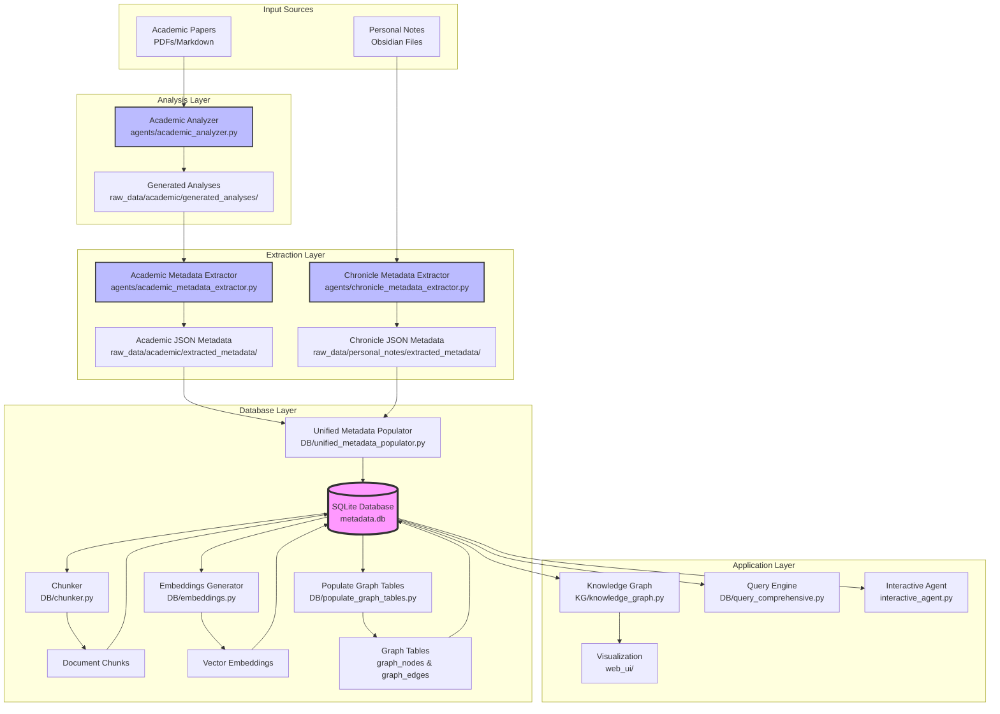

# Database System Architecture

## Overview

The DB folder contains the complete database infrastructure for the Interactive CV system. It implements a sophisticated pipeline that transforms raw documents into a queryable knowledge graph with semantic search capabilities.

## System Architecture



## Core Components

### 1. **Database Schema** (`metadata.db`)

The database uses a normalized design with the following tables:

#### Document Tables
- `academic_documents`: Research papers and analyses
- `chronicle_documents`: Personal notes (daily/weekly/monthly)
- `documents`: Unified view for backward compatibility

#### Entity Tables
- `topics`: Research areas and concepts (with category, description)
- `people`: Authors and collaborators (with role, affiliation)
- `projects`: Research and development projects
- `institutions`: Universities and research centers
- `methods`: Analytical and computational techniques
- `applications`: Real-world use cases

#### Relationship Tables
- `relationships`: Unified table for ALL entity connections
- `graph_nodes`: Pre-computed nodes for visualization
- `graph_edges`: Pre-computed edges with weights

#### RAG Support Tables
- `document_chunks`: Semantic segments (1000-1500 tokens)
- `chunk_entities`: Maps entities to their chunks
- `embeddings`: Vector embeddings for all content

### 2. **Database Management Scripts**

#### `build_database.py`
Builds the entire database from scratch:
```bash
python DB/build_database.py [--backup] [--skip-embeddings] [--skip-graph]
```
- Creates schema with proper indexes
- Imports all metadata from JSON files
- Chunks documents semantically
- Generates embeddings
- Populates graph tables

#### `update_database.py`
Incrementally updates the database:
```bash
python DB/update_database.py [--skip-embeddings] [--skip-graph]
```
- Detects new documents
- Processes only changes
- Maintains consistency

### 3. **Data Processing Pipeline**

#### `unified_metadata_populator.py`
Central importer that:
- Reads JSON metadata files
- Validates data integrity
- Populates all entity tables
- Creates relationships
- Handles both academic and chronicle sources

#### `chunker.py`
Intelligent document segmentation:
- Preserves section boundaries
- Maintains semantic coherence
- 1000-1500 token chunks
- 200 token overlap
- Maps entities to chunks

#### `embeddings.py`
Vector generation using OpenAI:
- Document-level embeddings
- Chunk-level embeddings
- Entity embeddings with verification
- Efficient batch processing
- Interactive verification mode for entities
- `find_similar()` method for similarity search

**New Features:**
- `--entities-only` flag to generate only entity embeddings
- `--verify` flag for interactive verification before generation
- Shows samples and statistics before processing each entity type

#### `populate_graph_tables.py`
Graph table population:
- Converts entities to nodes
- Creates edges from relationships
- Adds co-occurrence edges
- Computes edge weights

### 4. **Query Tools**

#### `query_comprehensive.py`
Database exploration tool with:
- Statistical summaries
- Entity browsing
- Relationship analysis
- Full-text search
- Export capabilities

#### `verify_entities.py`
Database verification tool for entity quality:
- Entity statistics by type
- Exact duplicate detection (case-insensitive)
- Fuzzy matching for similar entities
- Detection of suspiciously long entity names
- Random entity samples for manual review
- Export duplicate report functionality

**Usage:**
```bash
# Interactive verification
python verify_entities.py

# Export duplicate report
python verify_entities.py --export
```

## Data Flow

1. **Document Analysis**
   - Academic papers → Academic Analyzer → Structured analyses
   - Personal notes → Direct to extraction

2. **Metadata Extraction**
   - Analyses/Notes → LLM Extractors → JSON metadata files
   - Preserves full context during extraction

3. **Database Population**
   - JSON files → Unified Populator → SQLite database
   - Atomic transactions ensure consistency

4. **Chunking & Embedding**
   - Documents → Chunker → Semantic segments
   - All content → Embeddings → Vector store

5. **Graph Construction**
   - Entities + Relationships → Graph Tables → Knowledge Graph
   - Pre-computed for performance

## Key Design Decisions

### Why This Architecture?

1. **Separation of Concerns**
   - Analysis separate from extraction
   - Extraction separate from storage
   - Each component has single responsibility

2. **Full Context Extraction**
   - LLMs see complete documents
   - Cross-reference detection
   - Relationship inference

3. **Efficient Retrieval**
   - Pre-computed graph tables
   - Indexed relationships
   - Vector embeddings at multiple levels

4. **Flexibility**
   - JSON intermediate format
   - Modular components
   - Easy to extend/modify

### Database Design Principles

1. **Normalization**: No duplicate data
2. **Unified IDs**: `{type}_{id}` format
3. **JSON Metadata**: Flexible attributes
4. **Pre-computation**: Graph tables for speed
5. **Backward Compatibility**: Views for legacy queries

## Usage Examples

### Complete Pipeline
```bash
# 1. Extract metadata (if not done)
python scripts/extract_academic_metadata.py
python scripts/extract_personal_notes_metadata.py

# 2. Build database from scratch
cd DB
python build_database.py --backup

# 3. View database
datasette metadata.db
```

### Incremental Updates
```bash
# Add new documents
cd DB
python update_database.py

# Update graph only
python populate_graph_tables.py
```

### Query Database
```bash
# Interactive exploration
python query_comprehensive.py

# SQL queries
sqlite3 metadata.db "SELECT * FROM topics WHERE category='machine-learning'"
```

### Entity Deduplication Workflow
```bash
# 1. Verify current database state
python verify_entities.py

# 2. Generate entity embeddings with verification
python embeddings.py --entities-only --verify

# 3. Find duplicates (dry run)
cd ../agents
python entity_deduplicator.py --dry-run

# 4. Create backup and merge duplicates with parallel processing
python entity_deduplicator.py --parallel-workers 20 --merge --backup

# 5. Rebuild graph tables after deduplication
cd ../DB
python populate_graph_tables.py
```

**Enhanced Deduplication Features**:
- **Transitive Clustering**: Groups chains of duplicates (e.g., "V.Laschos" → "V. Laschos" → "V.Laschos")
- **Parallel Processing**: Up to 20 workers for LLM verification
- **Smart Canonical Selection**: Chooses best entity based on:
  - Relationship count (most connected entity wins)
  - Proper capitalization
  - No kebab-case or underscores
  - Proper spacing after punctuation
  - Length (more complete names preferred)
  - Additional metadata presence
- **Conflict Resolution**: Handles duplicate relationships during merge

## File Structure
```
DB/
├── README.md                    # This file
├── metadata.db                  # SQLite database (not in git)
├── build_database.py            # Complete database builder
├── update_database.py           # Incremental updater
├── unified_metadata_populator.py # JSON to database importer
├── chunker.py                   # Document chunking
├── embeddings.py                # Vector embedding generation
├── populate_graph_tables.py     # Graph table population
├── query_comprehensive.py       # Database exploration
├── verify_entities.py           # Entity quality verification
└── extractors/                  # Base extraction classes
    ├── __init__.py
    └── base_extractor.py        # Shared extraction logic
```

## Dependencies

- SQLite 3.x
- Python packages:
  - `sqlite3` (built-in)
  - `langchain` (for chunking)
  - `openai` (for embeddings)
  - `tiktoken` (for token counting)
  - `networkx` (for graph analysis)

## Best Practices

1. **Always backup** before rebuilding: `python build_database.py --backup`
2. **Check JSON** before importing: Review extracted metadata
3. **Monitor tokens**: Embedding generation uses API credits
4. **Test queries**: Use query_comprehensive.py before production
5. **Version control**: Don't commit metadata.db (use .gitignore)

## Troubleshooting

### Common Issues

1. **"Database locked"**: Close other connections (Datasette, etc.)
2. **Missing embeddings**: Check OPENAI_API_KEY in .env
3. **Empty graph**: Run populate_graph_tables.py
4. **Slow queries**: Check indexes with `EXPLAIN QUERY PLAN`

### Maintenance

- Regular backups: `cp metadata.db metadata.db.backup`
- Vacuum periodically: `sqlite3 metadata.db "VACUUM"`
- Update statistics: `sqlite3 metadata.db "ANALYZE"`
- Entity deduplication: Run periodically to clean up extraction artifacts

**Deduplication Results (Latest)**:
- Total: 965 → 905 nodes (60 duplicates removed, 6.2% reduction)
- Topics: 577 → 542 (35 removed)
- Projects: 13 → 8 (5 removed)
- Methods: 132 → 114 (18 removed)
- People: 175 → 174 (1 removed)
- Applications: 25 → 24 (1 removed)
- Edges increased: 2232 → 2594 (merged entities combine relationships)

## Future Enhancements

1. **PostgreSQL support**: For production scale
2. **Incremental embeddings**: Update only changed content
3. **Graph algorithms**: Community detection, centrality
4. **Query optimization**: Materialized views for common queries
5. **Version tracking**: Document revision history