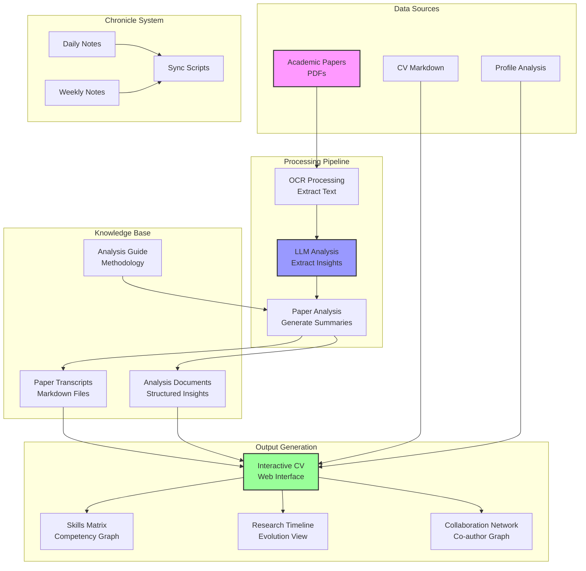
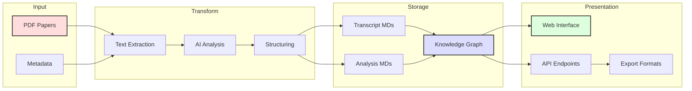
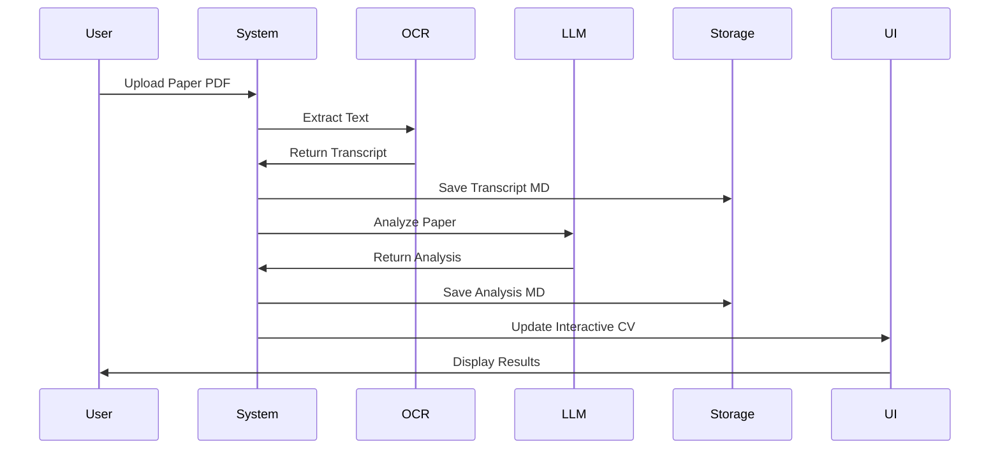
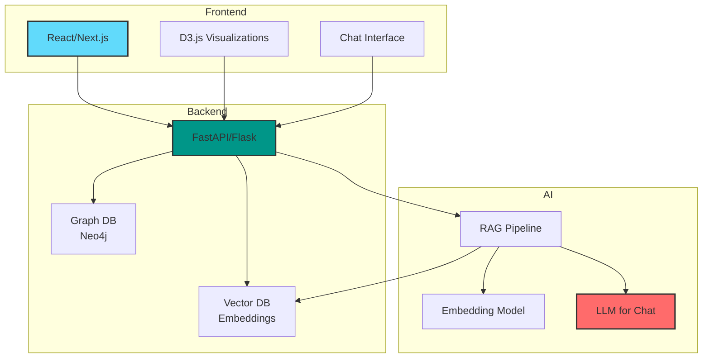

# Interactive CV Project Architecture

## Project Overview
This project creates an interactive CV system that analyzes academic papers to build a comprehensive professional profile. It combines mathematical research papers with AI/ML analysis to generate insights about research expertise and career trajectory.

## System Architecture

## Data Flow Diagram

## Component Interactions

## Project Goals & Implementation Ideas

### Current State
- ✅ Paper transcripts extracted via OCR
- ✅ AI analysis of papers completed
- ✅ CV and profile documents created
- ✅ Analysis methodology documented
- ⏳ Interactive interface pending

### Proposed Features

1. **Interactive Web Interface**
   - Dynamic visualization of research areas
   - Clickable paper summaries with full analysis
   - Skill competency radar charts
   - Research timeline with key contributions

2. **Knowledge Graph Visualization**
   - Network graph of research topics
   - Connection strength based on paper relationships
   - Interactive exploration of research evolution
   - Collaboration network visualization

3. **AI-Powered Features**
   - Chat interface to query research expertise
   - Automatic generation of research statements
   - Skill matching for job descriptions
   - Research impact analysis

4. **Export Capabilities**
   - Generate tailored CVs for specific positions
   - Export research portfolio as PDF
   - API for programmatic access
   - Integration with academic platforms

### Technical Implementation

### Development Roadmap

1. **Phase 1: Static Site Generation**
   - Convert markdown to static HTML
   - Basic navigation and search
   - Deploy to GitHub Pages/Netlify

2. **Phase 2: Interactive Visualizations**
   - Add D3.js research network graph
   - Implement timeline visualization
   - Create skill competency charts

3. **Phase 3: Dynamic Features**
   - Implement backend API
   - Add vector search for papers
   - Create chat interface with RAG

4. **Phase 4: Advanced Analytics**
   - Research impact metrics
   - Collaboration analysis
   - Trend identification
   - Career trajectory modeling

### Key Benefits
- **For Job Applications**: Instantly generate tailored CVs highlighting relevant research
- **For Collaboration**: Easy discovery of expertise areas and potential synergies
- **For Self-Reflection**: Visualize research evolution and identify future directions
- **For Knowledge Management**: Centralized, searchable repository of all research work